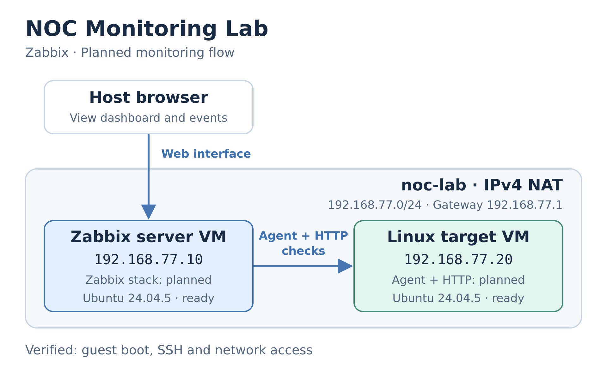

# 📡 NOC Monitoring Lab — Zabbix

A practical monitoring portfolio built around one workflow: **detect a fault, investigate the cause, restore service and verify recovery**.

The lab uses two Linux virtual machines to explore host availability, HTTP service health and CPU monitoring. Each fault exercise will record the observed problem and recovery times.

> **Work in progress:** both Ubuntu guests were running at the 2026-09-27 baseline check. Boot, SSH, guest-to-guest connectivity, DNS and package repository access are verified. Zabbix deployment and fault exercises are next. See the [verified results and test limits](docs/VALIDATION.md).

## Lab overview

Planned monitoring flow on the configured `noc-lab` NAT network:

*Logical design · [Editable SVG](docs/topology.svg) · [Verified scope](docs/VALIDATION.md)*

| Layer | Technology | State |
|---|---|---|
| Virtualization | QEMU/KVM, libvirt, virt-manager | Installed; KVM lifecycle verified |
| Guest systems | Ubuntu Server 24.04.5 LTS | Running; baseline connectivity verified |
| Monitoring | Zabbix 7.0 LTS, Linux agent and HTTP service | Planned |

The starting guest budget is **3 vCPUs and 5 GiB RAM in total**. Resource allocations, addresses and setup commands are documented in the [build guide](docs/LAB.md).

## 🔎 Fault exercises

All three exercises are **planned, not yet tested**. Faults will run inside the disposable target VM.

| Scenario | Fault | What to verify |
|---|---|---|
| MON-01 · Service outage | Stop the HTTP service | A service problem appears while the host remains reachable; restarting the service clears it. |
| MON-02 · Host unavailable | Shut down the target VM | Host availability fails; check dependent alert suppression and recovery after boot. |
| MON-03 · CPU pressure | Run a bounded CPU load | Sustained load triggers an alert; ending the load produces a recovery event. |

The intended result is a small dashboard, measured detection and recovery timings, reusable configuration exports and short troubleshooting runbooks. Initial alerts will be local dashboard events.

## ✅ Progress

- [x] Inspect host capacity and hardware virtualization.
- [x] Prepare and check KVM, the lab network and storage.
- [x] Create both guests and verify connectivity.
- [ ] Install Zabbix and collect the first target metric.
- [ ] Configure monitoring, triggers and a dashboard.
- [ ] Reproduce all three faults and document recovery.

## Explore the project

- **[Build guide](docs/LAB.md)** — VM roles, network settings and steps to reproduce the guest baseline.
- **[Validation results](docs/VALIDATION.md)** — directly observed checks and what remains untested.
- **[Network configuration](configs/libvirt/noc-lab.xml)** — reusable libvirt NAT network and DHCP reservations.
- **[Guest creation script](scripts/create-guests.py)** — pinned image, separate disks and a [cloud-init template](configs/cloud-init/user-data.example).

To reproduce the setup, start with the build guide and check the proposed subnet and resource budget against your own host. VM images, credentials and generated local files are excluded from this repository.
